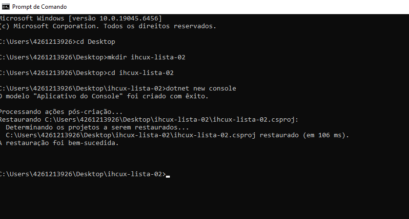
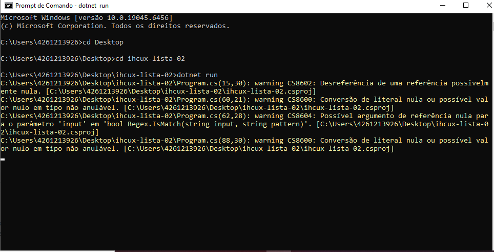
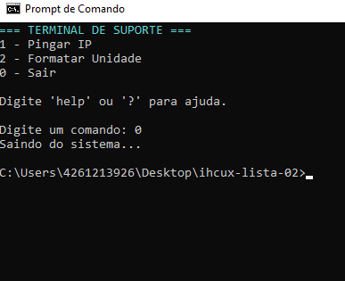
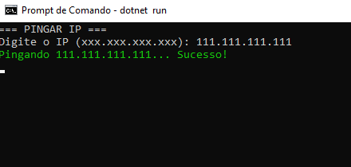
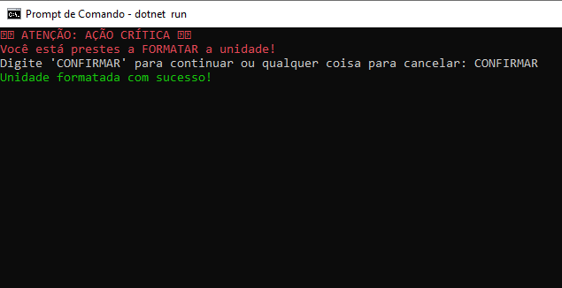

# ihcux-lista-02
LISTA 

CODIGO USADO : 

using System;
using System.Text.RegularExpressions;

class Program
{
    static void Main()
    {
        while (true)
        {
            Console.Clear();
            MostrarMenu();

            Console.Write("\nDigite um comando: ");
            string comando = Console.ReadLine().ToLower();

            if (comando == "1")
            {
                Ping();
            }
            else if (comando == "2")
            {
                Formatar();
            }
            else if (comando == "help" || comando == "?")
            {
                Ajuda();
            }
            else if (comando == "0")
            {
                Console.WriteLine("Saindo do sistema...");
                return;
            }
            else
            {
                Erro("Comando inválido. Use o menu.");
            }
        }
    }

    static void MostrarMenu()
    {
        Console.ForegroundColor = ConsoleColor.Cyan;
        Console.WriteLine("=== TERMINAL DE SUPORTE ===");
        Console.ResetColor();

        Console.WriteLine("1 - Pingar IP");
        Console.WriteLine("2 - Formatar Unidade");
        Console.WriteLine("0 - Sair");

        Console.WriteLine("\nDigite 'help' ou '?' para ajuda.");
    }

    static void Ping()
    {
        Console.Clear();
        Console.WriteLine("=== PINGAR IP ===");

        Console.Write("Digite o IP (xxx.xxx.xxx.xxx): ");
        string ip = Console.ReadLine();

        if (!Regex.IsMatch(ip, @"^\d{1,3}(\.\d{1,3}){3}$"))
        {
            Console.ForegroundColor = ConsoleColor.Yellow;
            Console.WriteLine("IP inválido! Use o formato: xxx.xxx.xxx.xxx");
            Console.ResetColor();
            Console.ReadLine();
            return;
        }

        Console.ForegroundColor = ConsoleColor.Green;
        Console.WriteLine($"Pingando {ip}... Sucesso!");
        Console.ResetColor();

        Console.ReadLine();
    }

    static void Formatar()
    {
        Console.Clear();

        Console.ForegroundColor = ConsoleColor.Red;
        Console.WriteLine("⚠️ ATENÇÃO: AÇÃO CRÍTICA ⚠️");
        Console.WriteLine("Você está prestes a FORMATAR a unidade!");
        Console.ResetColor();

        Console.Write("Digite 'CONFIRMAR' para continuar ou qualquer coisa para cancelar: ");
        string confirmacao = Console.ReadLine();

        if (confirmacao == "CONFIRMAR")
        {
            Console.ForegroundColor = ConsoleColor.Green;
            Console.WriteLine("Unidade formatada com sucesso!");
            Console.ResetColor();
        }
        else
        {
            Console.ForegroundColor = ConsoleColor.Yellow;
            Console.WriteLine("Operação cancelada.");
            Console.ResetColor();
        }

        Console.ReadLine();
    }

    static void Ajuda()
    {
        Console.Clear();

        Console.ForegroundColor = ConsoleColor.Cyan;
        Console.WriteLine("=== AJUDA ===");
        Console.ResetColor();

        Console.WriteLine("1 - Pingar IP: Testa conexão com um IP.");
        Console.WriteLine("2 - Formatar Unidade: Apaga todos os dados (cuidado!).");
        Console.WriteLine("0 - Sair: Encerra o sistema.");

        Console.WriteLine("\nUse números do menu para navegar.");

        Console.ReadLine();
    }

    static void Erro(string mensagem)
    {
        Console.ForegroundColor = ConsoleColor.Red;
        Console.WriteLine(mensagem);
        Console.ResetColor();
        Console.ReadLine();
    }
}

/*
Heurísticas aplicadas:

5 - Prevenção de Erros:
Ações críticas como "Formatar Unidade" pedem confirmação extra.

6 - Reconhecimento em vez de Recordação:
Menu fixo com comandos visíveis (não precisa decorar).

10 - Ajuda e Documentação:
Comando "help" ou "?" mostra explicações sem sair do fluxo.
*/

